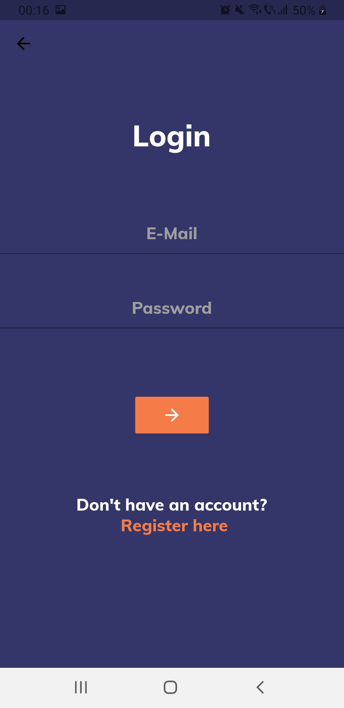

# Professor review

A mobile application for reviewing university professors.  
Developed using Flutter and Firebase.  
The objective of this app is to provide the much needed transparency
that our society demands and valuable feedback to the professors.  

## How to install

First of all, this app only works on Android for now.  
You can find the .apk files for arm64, armeabi and x86_64 architectures in
the out/release folder.  
If for some reason you cannot install the .apk, setup Flutter on your computer. 
You can find links to tutorials in the wiki.
After that, download or clone the project, connect your Android device
to your computer and, from your command line, run:  
* `cd<app_dir>`, where app_dir is application directory.
* `flutter install`

## How to use the app

First, you need to create an account (or login if you already have one).  

  

On the home screen, you will find a search bar, a list of the best rated 
universities and two icons on the right corner of the top bar. 

  

Press the icon on the right to logout.  
  
Press the other icon to view your profile.  
  
Here, you will find the average rating that you give to professors, and a list 
of your reviews.  
Press a review to view it.  
  

A review contains the pros and the cons of the professor and a few ratings.  
A review screen also contains two boxes at the top, one with the user who submitted
the review and one with the professor that the user reviewed. Pressing either 
one will take you to a profile screen.  

At the top of a professor's profile screen, you will find the professor's university
and their faculty. You can press either one and it will take to a profile screen.    
  

Below that, you will see the professor's rating and a list of their reviews.
You will also see a Add Review button. Pressing it will take you to the 
review submittion screen.  

  

To search for a specific professor or university, go back to the home screen
and press the search bar. Another screen will appear, where you can perform
the search. Please note that you have the enter the full name of the university,
if you are searching for a university, or the full first name/ last name, if
you are searching a professor. Also, please note, that the searches are NOT
case sensitive yet.  

